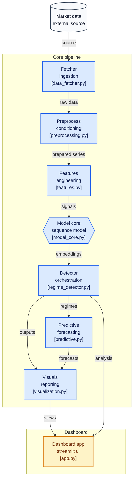

# 🔮 ORACLE: Market Regime Detection System

[](https://github.com/Youcef3939/ORACLE)
[](https://www.python.org/downloads/)
[](https://streamlit.io/)
[](https://github.com/Youcef3939/ORACLE)
[](LICENSE)
[](https://github.com/Youcef3939/ORACLE)

> A sophisticated deep learning system that detects hidden market regimes across multiple asset classes in real-time, enabling early crisis detection and bull run identification through advanced neural network architectures.

## 📋 Table of Contents

- [Overview](#overview)
- [Features](#features)
- [Quick Start](#quick-start)
- [Installation](#installation)
- [Usage](#usage)
- [Architecture](#architecture)
- [Project Structure](#project-structure)
- [Configuration](#configuration)
- [Dashboard Preview](#dashboard-preview)
- [Future Enhancements](#future-enhancements)
- [Contributing](#contributing)
- [License](#license)

## 🎯 Overview

**ORACLE** is an intelligent market regime detection system designed for quantitative analysts, traders, and financial researchers. It leverages state-of-the-art deep learning techniques (Transformers & Variational Autoencoders) to identify and analyze hidden market regimes across stocks, bonds, commodities, and foreign exchange markets.

### Why Market Regime Detection?

Traditional trading strategies often assume market conditions are static. ORACLE recognizes that financial markets transition through distinct regimes:
- 🐂 **Bull Markets**: Rising trends with low volatility
- 🐻 **Bear Markets**: Declining trends with high volatility  
- ⚠️ **Crisis Regimes**: Extreme volatility and systemic risk
- 🔄 **Recovery Regimes**: Transition periods between states

By detecting these regimes in real-time, ORACLE helps:
- Adapt trading strategies to market conditions
- Identify early warning signals for financial crises
- Capitalize on regime transition opportunities
- Understand complex relationships between asset classes

## ✨ Features

### Core Capabilities

- **🌍 Multi-Asset Awareness**
  - Stocks, bonds, commodities, foreign exchange (FX)
  - Macro-economic indicators integration
  - Cross-asset correlation analysis

- **🧠 Latent Market Embeddings**
  - Variational Autoencoders (VAE) for dimensionality reduction
  - Transformer-based architectures for sequential pattern recognition
  - Learns compressed representations of market states

- **🎯 Unsupervised Regime Detection**
  - Clustering algorithms reveal hidden market regimes
  - Automatic identification of bull, bear, crisis, and recovery states
  - Temporal continuity for stable regime assignments

- **📊 Interactive Visualization Dashboard**
  - Real-time regime timeline with historical analysis
  - 2D/3D embeddings projections
  - Asset correlation heatmaps
  - Macro indicator overlays
  - Regime probability distributions

- **🔮 Predictive Module**
  - Forecast upcoming regime probabilities
  - Confidence intervals for predictions
  - Historical accuracy metrics

- **🎮 Scenario Simulation**
  - "What-if" analysis for market events
  - Stress test impact on regime predictions
  - Sensitivity analysis across asset classes

## 🚀 Quick Start

### Minimal Example

```python
from oracle import MarketRegimeDetector
import yfinance as yf

# Download market data
data = yf.download(['SPY', 'TLT', 'GLD', 'EURUSD=X'], 
                   start='2020-01-01', end='2024-01-01')

# Initialize detector
detector = MarketRegimeDetector(n_regimes=4, model_type='transformer')

# Fit model and detect regimes
regimes = detector.fit_predict(data)

# Get regime probabilities
probs = detector.predict_proba(data)

print(f"Current regime: {regimes[-1]}")
print(f"Regime probabilities: {probs[-1]}")
```

### Run the Dashboard

```bash
streamlit run dashboard/app.py
```

Visit `http://localhost:8501` in your browser to interact with the dashboard.

## 📦 Installation

### Prerequisites

- Python 3.10 or higher
- pip or conda package manager
- 4GB+ RAM recommended (8GB+ for production use)
- Optional: GPU (CUDA 11.8+) for faster training

### Step-by-Step Installation

#### 1. Clone the Repository

```bash
git clone https://github.com/Youcef3939/ORACLE.git
cd ORACLE
```

#### 2. Create a Virtual Environment

**Linux/macOS:**
```bash
python3 -m venv venv
source venv/bin/activate
```

**Windows:**
```bash
python -m venv venv
venv\Scripts\activate
```

#### 3. Install Dependencies

```bash
pip install --upgrade pip
pip install -r requirements.txt
```

**Optional:** For GPU acceleration:
```bash
pip install torch torchvision torchaudio --index-url https://download.pytorch.org/whl/cu118
```

#### 4. Verify Installation

```python
python -c "import oracle; print('Installation successful!')"
```

## 💻 Usage

### Basic Usage

```python
from oracle import MarketRegimeDetector, DataLoader
import pandas as pd

# Load data
loader = DataLoader()
data = loader.fetch_data(
    tickers=['SPY', 'TLT', 'GLD'],
    start_date='2020-01-01',
    end_date='2024-01-01'
)

# Initialize detector
detector = MarketRegimeDetector(
    n_regimes=4,
    model_type='transformer',  # or 'vae'
    lookback_period=60,
    test_size=0.2
)

# Fit the model
detector.fit(data)

# Predict regimes
regimes = detector.predict(data)

# Get probability estimates
probabilities = detector.predict_proba(data)

# Analyze results
analysis = detector.get_analysis(data)
print(analysis)
```

### Advanced Configuration

See [Configuration](#configuration) section for detailed parameter tuning.

### Using Pre-trained Models

```python
from oracle import MarketRegimeDetector

# Load a pre-trained model
detector = MarketRegimeDetector.load('models/pretrained_transformer.pkl')

# Use for prediction
regimes = detector.predict(new_data)
```

## 🏗️ Architecture

### System Overview

```
┌─────────────────────────────────────────────────────────────┐
│                     ORACLE System                           │
└─────────────────────────────────────────────────────────────┘
                              │
                ┌─────────────┼─────────────┐
                ▼             ▼             ▼
            ┌────────┐  ┌────────┐  ┌──────────┐
            │ Stocks │  │ Bonds  │  │Commodities│
            └────────┘  └────────┘  └──────────┘
                 │            │           │
                 └────────────┼───────────┘
                              ▼
                    ┌──────────────────┐
                    │  Data Pipeline   │
                    │  • Validation    │
                    │  • Normalization │
                    │  • Alignment     │
                    └──────────────────┘
                              ▼
                    ┌──────────────────┐
                    │ Feature Eng.     │
                    │  • Returns       │
                    │  • Volatility    │
                    │  • Correlations  │
                    └──────────────────┘
                              ▼
                    ┌──────────────────┐
                    │  Model Core      │
                    │  ┌────────────┐  │
                    │  │ Transformer│  │
                    │  └────────────┘  │
                    │  ┌────────────┐  │
                    │  │    VAE     │  │
                    │  └────────────┘  │
                    └──────────────────┘
                              ▼
                    ┌──────────────────┐
                    │ Regime Detection │
                    │  • Clustering    │
                    │  • Smoothing     │
                    │  • Validation    │
                    └──────────────────┘
                              ▼
                    ┌──────────────────┐
                    │ Dashboard & API  │
                    │  • Visualization │
                    │  • Alerts        │
                    │  • Exports       │
                    └──────────────────┘
```

### Data Flow

```
Raw Data 
  ↓
Preprocessing (cleaning, alignment, resampling)
  ↓
Feature Engineering (returns, volatility, correlations, momentum)
  ↓
Model Core (Transformer/VAE encoding)
  ↓
Latent Embeddings (compressed market representations)
  ↓
Clustering (K-means, DBSCAN, or GMM)
  ↓
Regime Labels (bull, bear, crisis, recovery)
  ↓
Visualization & Alerts (dashboard, notifications, exports)
```

## 📁 Project Structure

```
ORACLE/
├── src/
│   ├── __init__.py
│   ├── data_loader.py          # Data fetching and preprocessing
│   ├── feature_engineering.py  # Feature calculation
│   ├── models/
│   │   ├── __init__.py
│   │   ├── transformer.py      # Transformer model
│   │   ├── vae.py              # VAE model
│   │   └── clustering.py       # Clustering algorithms
│   ├── regime_detector.py      # Main detection logic
│   └── utils.py                # Utility functions
├── dashboard/
│   ├── app.py                  # Streamlit dashboard
│   ├── pages/
│   │   ├── analysis.py
│   │   ├── predictions.py
│   │   └── settings.py
│   └── assets/
│       └── styles.css
├── notebooks/
│   ├── 01_data_exploration.ipynb
│   ├── 02_model_training.ipynb
│   └── 03_backtesting.ipynb
├── tests/
│   ├── __init__.py
│   ├── test_data_loader.py
│   ├── test_models.py
│   └── test_regime_detector.py
├── models/
│   └── pretrained_transformer.pkl  # Pre-trained models
├── config/
│   └── default.yaml            # Configuration file
├── requirements.txt            # Python dependencies
├── setup.py                    # Package setup
├── LICENSE                     # MIT License
└── README.md                   # This file
```

## ⚙️ Configuration

### Default Configuration (config/default.yaml)

```yaml
data:
  lookback_period: 60
  test_size: 0.2
  normalization: 'zscore'

model:
  type: 'transformer'  # 'transformer' or 'vae'
  n_regimes: 4
  hidden_dim: 128
  n_layers: 3
  dropout: 0.1

training:
  epochs: 100
  batch_size: 32
  learning_rate: 0.001
  early_stopping_patience: 10

clustering:
  algorithm: 'kmeans'  # 'kmeans', 'dbscan', 'gmm'
  n_init: 10
```

### Custom Configuration

```python
from oracle import MarketRegimeDetector

config = {
    'n_regimes': 5,
    'model_type': 'vae',
    'lookback_period': 90,
    'learning_rate': 0.0005
}

detector = MarketRegimeDetector(**config)
```
## diagram 


---


## 📊 Dashboard Preview

ORACLE provides an interactive Streamlit dashboard featuring:

- **Regime Timeline**: Historical regime assignments with regime probabilities
- **Embeddings Projection**: 2D/3D visualization of latent market space
- **Asset Correlations**: Real-time correlation matrices during each regime
- **Predictions**: Probabilistic forecasts for upcoming regimes
- **Scenario Analysis**: Interactive what-if analysis tools


## 🔮 Future Enhancements

### Planned Features

- [ ] **Enhanced Asset Coverage**: Integrate cryptocurrency markets and emerging market indicators
- [ ] **Predictive Regime Forecasting**: Transformer-based prediction of regime transitions (2-4 week horizon)
- [ ] **Real-Time Alerting System**: Email/Slack notifications for crisis detection and regime changes
- [ ] **Improved Clustering**: Hidden Markov Models (HMM) for temporal continuity constraints
- [ ] **Backtesting Engine**: Strategy backtesting conditional on detected regimes
- [ ] **Risk Metrics**: VaR, CVaR, and Sharpe ratio calculations per regime
- [ ] **API Deployment**: REST API for production integration
- [ ] **Multi-Horizon Analysis**: Detection across different time horizons
- [ ] **Explainability**: Feature importance and SHAP values for regime drivers

## 🤝 Contributing

Contributions are welcome! Please follow these steps:

1. Fork the repository
2. Create a feature branch (`git checkout -b feature/amazing-feature`)
3. Make your changes and commit (`git commit -m 'Add amazing feature'`)
4. Push to the branch (`git push origin feature/amazing-feature`)
5. Open a Pull Request

Please ensure your code:
- Follows PEP 8 style guidelines
- Includes docstrings and type hints
- Has accompanying tests
- Updates relevant documentation

## 📝 License

This project is licensed under the MIT License - see the [LICENSE](LICENSE) file for details.

## 📧 Contact & Support

- **GitHub Issues**: For bug reports and feature requests
- **Email**: For direct inquiries about the project

## 🙏 Acknowledgments

- Built with [PyTorch](https://pytorch.org/) for deep learning
- Dashboard powered by [Streamlit](https://streamlit.io/)
- Data sourced via [yfinance](https://github.com/ranaroussi/yfinance)

---

<div align="center">

**Made with ❤️ for the quantitative finance community**

[⭐ Star this repo](https://github.com/Youcef3939/ORACLE) if you find it useful!

</div>
